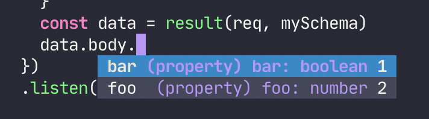

# Usage example with `express`

`bueno` can quickly be integrated into an `express` project, providing
validation on endpoints with helpful error messages, as well adding
autocompletion and type safe access to the request data.

```typescript
import express from 'express'
import bodyParser from 'body-parser'
import { atLeast, optional, boolean, either, enUS, even, object, number, string, length, result, checkPerKey, toNumber } from 'bueno'

const mySchema = object({
    params: object({
        id: toNumber(either(even, atLeast(100)))
    }),
    query: object({
        name: optional(string(length(atLeast(5))))
    }),
    body: object({
        foo: number,
        bar: boolean
    })
})

express()
    .post('/hi/:id', bodyParser.json(), (req: any, res: any) => {
        const errors = checkPerKey(req, mySchema, enUS)
        if (Object.keys(errors).length) {
            return res.status(500).send(JSON.stringify(errors, null, 2) + '\n')
        }
        const data = result(req, mySchema)
        return res.status(200).send('Ok!\n')
    })
    .listen(3030)
```

In addition to validating the request, editors will now provide
auto-completion & type safety for the request parameters. 🎉



Here's the output when calling the endpoint with some different parameters.

```bash
>> curl -d '' 'http://localhost:3030/hi/99'
{
  "body": {
    "bar": "Must be true or false",
    "foo": "Must be a number"
  },
  "params": {
    "id": "Must be even or at least 100"
  }
}

>> curl -d '' 'http://localhost:3030/hi/100?name=bob'
{
  "body": {
    "bar": "Must be true or false",
    "foo": "Must be a number"
  },
  "query": {
    "name": "Must have length at least 5"
  }
}

>> curl -d '' 'http://localhost:3030/hi/100?name=robert'
{
  "body": {
    "bar": "Must be true or false",
    "foo": "Must be a number"
  }
}

>> curl -d '{ "foo": "123" }' --header "Content-Type: application/json" 'http://localhost:3030/hi/100?name=robert'
{
  "body": {
    "bar": "Must be true or false",
    "foo": "Must be a number"
  }
}

>> curl -d '{ "foo": 123, "bar": true  }' --header "Content-Type: application/json" 'http://localhost:3030/hi/100?name=robert'
Ok!
```
