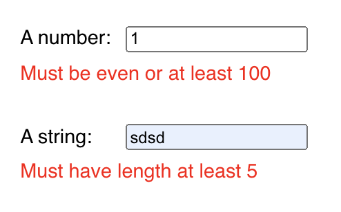

# Usage example: Vanilla JS form

</img>

### HTML

```html
<!DOCTYPE html>
<html lang="en">
  <body>
    <form id="myForm">
      <div>
        <label for="num">A number:</label>
        <input type="number" value="0" id="num" onInput="update()">
        <div style="color: red">
          <span id="numError"></span>
        </div>
      </div>
      
      <div>
        <label for="str">A string:</label>
        <input id="str" onInput="update()">
        <div style="color: red">
          <span id="strError"></span>
        </div>
      </div>
    </form>
  </body>
</html>
```

### TypeScript

We provide TypeScript source for those who prefer it. You can get the
vanilla version for your preferred JavaScript version
[here](https://www.typescriptlang.org/play/?ssl=8&ssc=1&pln=1&pc=1#code/JYWwDg9gTgLgBAbzgQxgGQKbIM4wDRwDGAFhoQNYAKGUA0hgJ4EbAylTMB2AqgMrMA3DJwIQARgCsy+OLijBOAcwIAbYYrYEYEAHIBXEGJpwAvnABmUCCDgByMXuERbAKBeEInXHBANeJDBBkOABeOHEpQhgACgQXODhOAwAuOG19QxpoljYsjCERFHQsXGiARgAGCoBKWrx42RgoVLkFRWi1JTZo1EwcGIBWWur6k2qAbjdogHcFABMIaZRsFE4GaoA6PTA51AxQiz1OKOBPaOrEBo8veHNoGxCGhOiFwgNhGA27qBAVnFX1htfAAxe5uBLXbwKMB6eBhOIJBJJECpb4gDbIjYCZAqRzLRryJT1REE1H3DZyLE4vH-VpKBomcFETzeKAYbB6FRwp5EUgUah0RjRaGwgi+fykIJcPgTJmvd6cT4AR0cUD8GDUUWg0VsAGJkQBRKBWKC2aoAQg2Ck4NAAEgAVACyaAObI5XIxBjgAB9vXZXAl5SAPhsVTR1ZrtFAdbq5EaTWbLda7U6XWE3ZzPnIfX7bK5GUA). (Use Config -> Target)

```typescript
import { atLeast, checkPerKey, either, enUS, even, object, string, length, toNumber } from 'bueno'

const mySchema = object({
  num: toNumber(either(even, atLeast(100))),
  str: string(length(atLeast(5))),
});

(window as any).update = function() {
  const form =
    (document.forms as any).myForm

  const input = {
    num: form.num.value as string,
    str: form.str.value as string
  }

  const result =
    checkPerKey(input, mySchema, enUS);

  document.querySelector('#numError')!.innerHTML = result.num || ''
  document.querySelector('#strError')!.innerHTML = result.str || ''
}
```
